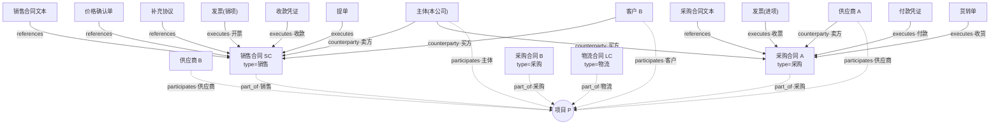

# 项目维度与合同类型细分设计（Project hub + contractType）

- **Status**: Design (user-approved direction 2026-08-20; awaiting plan review)
- **Date**: 2026-08-20
- **Augments**: `2026-08-17-graph-relations-design.md`（文档中心图模型）与
  `2026-08-18-binding-workbench-design.md`（绑定状态机 + 图同步）——本设计在其上
  增加**项目聚合枢纽**与**合同类型正交维度**，不改既有五类边（party/commodity/
  references/executes/binds）的语义。
- **Grounding**: 用户需求（合同类型细分；项目实体；项目关联销售/采购对象；项目为
  统一统计维度服务报表）；既有实现 `domain/flowDirection.ts`（主体侧别判定）、
  `pipeline/executionFlow.ts`（六向执行流水）、`contractLedger.ts`（台账）、
  `bindingGraphSync.ts`（SSOT 关系库 + 图同步模式）。

---

## 1. 问题与目标

当前状态（已勘察确认）：

- docType 是八类路由分类法（classifier / chunk taxonomy / executes 白名单 / 执行流水
  白名单全部以它为键），`合同` 是一个桶，**没有采购/销售/物流/租赁的细分**——
  合同对主体的方向语义（谁买谁卖、钱货票往哪流）无法从图上读出。
- **没有项目实体**：贸易按项目（一单业务）组织——一个项目下挂若干销售合同与
  采购/物流/租赁合同——现状只能按合同号孤立统计，没有跨合同的统一视图。
- 六向执行流水（`execution_flows`：资金/货物/发票 × in/out）已按 binding→contractNo
  物化，但只到合同粒度，无法上卷。

**目标**：

1. 合同获得**类型维度**（contractType，主体视角的受控词表），使单据-合同-三流的
   方向语义可判定、可校验；
2. **项目（Project）成为实体与聚合枢纽**：合同归属项目、交易方按角色参与项目；
3. **项目 = 统一统计维度**：合同面（额）/ 执行面（六向流水）/ 敞口 / 对账，一个
   rollup 服务供 API、前端视图与 Agent 报表共用。

**锁定决策**（用户已确认）：

| 决策 | 选择 | 理由 |
|---|---|---|
| contractType 位置 | **正交维度，不进 docType** | docType 是路由分类法 SSOT，塞细分会炸开 classifier/taxonomy/executes/流水白名单每一处 switch |
| contractType 视角 | **主体视角**（采购=主体买进，销售=主体卖出） | 与 `flowDirection.resolveSelfSide` 的"本公司是谁"基准一致；同一合同对对手方方向相反，图谱只表达主体视角 |
| 派生优先级 | 字段(合同类型) > 非方向关键词(物流/租赁/服务) > 主体侧别 > 方向关键词 | 文档明示的类型最可信；物流/租赁合同里主体常是"甲方(委托方)"，侧别会误判为采购 |
| Project 节点键 | **归一化项目编号**（无编号用归一化名称） | 与 Contract 按合同号建键同理：编号是身份，名称是展示 |
| 关系库 vs 图 | **projects + project_memberships 表为 SSOT，Neo4j 为同步视图** | 复用 bindings + bindingGraphSync 模式；报表联表（台账金额/流水聚合）不依赖图可达 |
| 交易方-项目边 | **派生边（participates），不人工维护** | 单一事实源是"合同归属 + 合同对手方"，独立维护必然漂移 |
| 合同对手方边 | **派生边（counterparty），由合同文档确认时折叠** | 让项目子图自包含（"这合同的客户是谁"一跳可达），Document→party 仍是 SSOT |
| docType / 既有五边 | **零改动** | 全部新增为增量（新节点 kind、新边类型、新列） |

---

## 2. 图模型

### 2.1 节点

Neo4j label 受 `assertToken`（`/^[A-Za-z_][A-Za-z0-9_]*$/`）约束——label 英文，
中文进 props。

| Label | MERGE 键 | 新增 props | 说明 |
|---|---|---|---|
| `Project`（新增） | `name` = 归一化项目编号 | `code, name(项目名), rawName, status` | 新实体 kind，`graphWriter`/`ProposedRelationship`/`ProposedEdge` 的联合类型同步扩展 |
| `Contract`（扩展） | `name` = 归一化合同号（不变） | `contractType` | 多文档对同一合同号给出不同类型：最新确认值覆盖（createEntity 的 ON MATCH SET props 语义），复核卡提示冲突 |
| `Document`（扩展） | `docId`（不变） | `contractType`（docType=合同时） | 与 `syncDocumentTypeToGraph` 同一幂等 MERGE 路径 |
| `Party` / `Commodity` | 不变 | — | — |

### 2.2 边（新增三类，全部受控词表）

每条边 props：`confidence, source: 'auto'|'manual'|'agent', createdAt`（+业务键）。

| 边 | 方向 | 含义 | 来源 |
|---|---|---|---|
| `part_of {role}` | `(Contract)-[:part_of]->(Project)` | 合同归属项目；role = contractType（采购/销售/物流/租赁…），"项目下的采购/销售合同"按 role 过滤 | 归属确认时写入（§4 三通道） |
| `counterparty {role}` | `(Party)-[:counterparty]->(Contract)` | 合同对手方；role = 买方/卖方（主体与对手方都产生） | **派生**：合同文档确认 / 归属确认时，由台账字段的甲乙方 + 主体侧别确定性派生 |
| `participates {role}` | `(Party)-[:participates]->(Project)` | 交易方参与项目；role = 供应商/客户/主体 | **派生**：part_of + counterparty + contractType（采购合同的卖方→供应商，销售合同的买方→客户，主体→主体）；仅 采购/销售 两类派生 |
| `references`（扩展） | `(Document)-[:references]->(Project)` | 单据直接提及项目（有项目字段、无合同号的立项/验收类文件） | 抽取到 projectFields 且无合同号时派生 |

派生边 `source:'auto'`；Agent L2 手动修正覆盖为 `'manual'`。既有五类边
（party/commodity/references/executes/binds）一字不改；`Document→party` 仍是
交易方关系的 SSOT，counterparty 是它的合同级折叠视图。

### 2.3 模式图

```mermaid
graph LR
    DOC["Document 单据<br/>props: docType, contractType"]
    PARTY["Party 主体/交易方"]
    COM["Commodity 商品"]
    CT["Contract 合同<br/>props: contractType"]
    PRJ["Project 项目<br/>props: code, name"]

    DOC -->|party {role}| PARTY
    DOC -->|commodity| COM
    DOC -->|references / executes / binds| CT
    DOC -.->|references 无合同号时| PRJ
    PARTY -->|counterparty {role} 派生| CT
    CT   -.->|part_of {role=合同类型}| PRJ
    PARTY -.->|participates {role} 派生| PRJ
```

### 2.4 实例图（一个项目的完整形态）



**文字关系表达**（业务问句 → 图路径）：

- "项目 P 有哪些采购合同" = `PRJ ←part_of(role=采购)– CT`
- "销售合同 SC 卖给谁" = `SC ←counterparty(role=买方)– PARTY`
- "项目 P 的供应商是谁" = `PRJ ←participates(role=供应商)– PARTY`（由"采购合同的
  卖方"派生）
- "采购合同 A 执行到什么程度" = `PCA ←executes/binds– DOC`（发票进项/付款/货转单/
  提单）
- "项目 P 一共开了多少票" = `PRJ ←part_of– CT ←executes– DOC(docType=发票)`，
  按 contractType 分成销项（销售合同下）与进项（采购合同下）

---

## 3. 合同类型维度（contractType）

### 3.1 受控词表（进 `domain/tradeSemantics.ts`，L1 SSOT）

```
ContractType = '采购' | '销售' | '物流' | '租赁' | '服务' | '其他'
```

词汇表新增（`TradeVocabulary` 接口 + `TRADE_VOCAB` 实例）：

- `contractTypes`：受控词表全集（枚举校验用）；
- `contractTypeByAlias`：文档写法 → 受控值。`采购合同/采购订单/采购协议→采购`、
  `销售合同/销售订单/销售协议→销售`、`物流合同/运输合同/货运合同/仓储合同→物流`、
  `租赁合同/第三方租赁合同/场地(设备)租赁合同→租赁`、`服务合同/咨询合同/代理协议→服务`。
  **`购销合同`/`买卖合同` 不映射**——无方向语义，宁可空进复核；
- `contractTypeKeywords`：标题扫描关键词（**键序即优先级**：物流/租赁/服务在前，
  采购/销售在后）：物流 `[物流,运输,货运,仓储]`、租赁 `[租赁,租用]`、服务
  `[服务,咨询,代理]`、采购 `[采购]`、销售 `[销售]`；
- `contractTypeBySide`：`buyer→采购, seller→销售`（主体侧别 → 类型）；
- `projectFields`：`{项目名称, 项目编号, 项目号, 工程名称}`；
- `participatesRoleByContractType`：`采购→供应商, 销售→客户`（派生 participates 边用）。

### 3.2 派生规则（纯函数 `domain/contractType.ts`）

```
deriveContractType({ docType, fields, selfPartyNames, vocab }) →
  { contractType: ContractType | null, source: 'field'|'side'|'keyword'|null, conflict: boolean }
```

仅 docType=合同 时派生，否则 null。优先级：

1. **字段**：抽取字段 `合同类型` 命中受控值或别名映射（含人工修正——修正以
   confidence 1.0 落为普通字段，天然最高优先）；
2. **非方向关键词**：`合同名称`/`标的物` 标题命中 物流/租赁/服务（这类合同主体
   常为"甲方=委托方"，侧别会误判，标题更特异）；
3. **主体侧别**：`买方|甲方`/`卖方|乙方` 锚点经 `resolveSelfSide` 判定
   （主体在买方侧→采购，卖方侧→销售；名单未配/双侧命中→null，不猜）；
4. **方向关键词**：标题命中 采购/销售（最后的兜底）。

**冲突标记**：字段给出 采购/销售 且侧别可判定且方向相反 → `conflict: true`
（复核卡黄条提示）；字段为 物流/租赁/服务 时与侧别不构成冲突（委托方向正常）。

### 3.3 存储与展示（同一规则三处消费，不漂移——与 deriveProposedEdges 同原则）

| 消费点 | 载体 |
|---|---|
| 台账 | `contract_ledger.contract_type` 列（SQLite TEXT / PG TEXT）；`buildLedgerEntryFromExtraction` 加可选 `contractType` 入参（builder 保持纯函数，self-party 判定在调用方 `documentEntry` 写回钩子做） |
| 复核卡 | `ReviewSnapshot.contractType: { contractType, source, conflict } | null`（快照读取时现派生；修正走既有 corrections 通道，name='合同类型'） |
| 图 | `commitDocumentGraph` 把快照派生值传入 `writeDocumentGraph`，写 `Contract` 节点与 `Document` 节点 props.contractType（幂等 MERGE，ON MATCH SET 覆盖旧值） |

Agent 侧 `queryContractLedger` 工具响应随台账列自动携带 contractType。

---

## 4. 项目实体与归属

### 4.1 关系库 SSOT（新表，DDL 真源在 `client.ts` migrate/migratePostgres）

```
projects            (id PK, code, name, status DEFAULT 'active', user_id, created_at, updated_at)
                    UNIQUE(code, user_id)   -- code 归一化(大写/去空白)
project_memberships (id PK, contract_no, project_code, role, status DEFAULT 'proposed',
                     proposed_by DEFAULT 'system', confirmation_source, confidence,
                     created_by, user_id, created_at, graph_status)
                    INDEX(project_code, user_id), INDEX(contract_no, user_id)
```

- `contract_no` 存 `normalizeContractNo` 归一化值（与 execution_flows 一致，而非
  bindings 的原文）——报表联表键；
- 状态机镜像 bindings：`proposed → confirmed | rejected`；`confirmation_source`:
  `auto_rule | human`；`proposed_by`: `system | agent | human`；
- `graph_status` 落图同步结果（BindingGraphStatus 同形）。

### 4.2 归属三通道

| 通道 | 机制 | 状态 |
|---|---|---|
| 自动提议 | `pipeline/projectProposal.ts` 纯函数：docType=合同 且同时有 合同号 + projectFields 字段 → 提议 membership（role=派生 contractType；confidence=两字段置信度取小）。挂 `documentEntry` 台账写回钩子旁（同一 fault-isolated 模式），项目行不存在时自动建（code=编号，无编号用归一化名称） | proposed |
| 工作台手动 | `routes/projects.ts`：POST /api/projects/:code/memberships 直接落 confirmed | confirmed (human) |
| Agent | `graph_find_entity(kind=Project)` 定位 + `link_entities` 建 part_of（L2 审批，既有工具，零新增写入路径） | confirmed (agent) |

确认（或手动创建）时经 `pipeline/projectGraphSync.ts` 同步图（§4.3）。

### 4.3 图同步（`pipeline/projectGraphSync.ts`，fault-isolated）

输入 membership（contractNo/projectCode/role/confidence/membershipId/projectName）：

1. 门禁：NEO4J_PASSWORD 未设 → skipped（非错误）；
2. ensure `Project` 节点（按归一化 code 精确查找，缺则 MERGE 创建，props
   {code, name}）与 `Contract` 节点（bindingGraphSync 的 ensureNode 模式）；
3. `mergeEdge (Contract)-[:part_of {role, membershipId, source}]->(Project)`；
4. **派生 counterparty**：读台账行字段（买方|甲方 / 卖方|乙方）+ 有效主体名单
   （`getEffectiveSelfPartyNames`）→ 双方各 ensure `Party` 节点 +
   `mergeEdge (Party)-[:counterparty {role: 买方|卖方}]->(Contract)`；
5. **派生 participates**（仅 role∈{采购,销售}）：对手方 →
   `participates {role: 供应商|客户}`；主体 → `participates {role: 主体}`；
6. 结果落 `project_memberships.graph_status`；任一步失败记 reason，不抛出。

移除归属（reject/unassign）只撤 `part_of` 边；派生边（counterparty/participates）
为 best-effort 投影，下次任一确认会按最新事实重算 MERGE——不追逐删除（简化，
记入已知限制）。

---

## 5. 项目统计视图与报表

### 5.1 统一维度

**项目 × 合同类型 × 流族(资金/货物/发票) × 方向(in/out) × 单据类型 × 对手方**。

金额来自 Postgres/SQLite（`contract_ledger.fields` 金额字段、`execution_flows`
聚合），拓扑来自 `project_memberships`（图仅作可视化，报表不依赖图可达）。

### 5.2 rollup 服务（`pipeline/projectRollup.ts`）

```
rollupProject(ctx, projectCode, userId) → ProjectRollup | null
```

- **合同面**：membership(confirmed) → 逐合同台账行 → 类型/标题/金额/对手方
  （对手方 = 甲乙锚点中非主体的那侧）；
- **执行面**：逐合同 `summarizeExecutionFlows` → 六向合计（收款/付款额、
  收/发货吨、进项/销项票额）；
- **指标**：`salesAmount / purchaseAmount / expenseAmount(物流+租赁+服务+其他)`；
  `grossMargin = sales − purchase − expense`；
  `receivableOpen = sales − 发票out − 收款in`；`payableOpen = purchase − 发票in − 付款out`；
- **对账 checks**（warn/info 两级）：
  - `type_direction_mismatch`：合同类型与流水方向矛盾（销售合同下出现 in 发票、
    采购合同下出现 out 发票）——contractType 与六向侧别判定的交叉校验；
  - `qty_gap`：货物流净量（收-发）非零（info 级，贸易允许在途）；
  - `amount_missing`：membership 有、台账无金额字段（warn）；
  - `unassigned_contracts`：有台账行但不在任何项目（接口级：GET /api/projects
    附带）。

聚合核心 `buildRollup(project, memberships, ledgers, flowSummaries)` 抽为纯函数，
单测无 DB；`rollupProject` 只做取数编排。

### 5.3 消费面

- API：`GET /api/projects/:code/rollup`；
- 前端：ProjectsView（项目列表 + rollup 面板：合同面/执行面/敞口/对账清单）；
  图谱页新增 Project 节点 kind 与三类边中文标签；
- Agent：`project_rollup` L1 只读工具（"项目 P 执行到什么程度/毛利多少"直达）。

---

## 6. Agent 自然语言交互

- `graph_find_entity` 的 kind 枚举加 `'Project'`（"找到项目 P" → graph_query 展开
  子图）；
- SYSTEM_PROMPT 增"项目维度"指引段：项目问题先 find_entity(Project)；归属维护
  建言 part_of（L2）；报表/执行进度问题用 `project_rollup`；图不可达时如实告知；
- `link_entities` 建边时 props.role 写合同类型（受控词表），提示词中给出示例。

---

## 7. 验证计划

- **单测**（vitest，纯函数 in-memory / fake io）：
  - `deriveContractType`：优先级矩阵（字段>非方向关键词>侧别>方向关键词）、
    购销合同不映射、双侧命中不猜、conflict 判定、非合同 docType 返回 null；
  - 台账：contract_type 列落库/读回（SQLite + PG twin）、写回钩子派生；
  - 快照：contractType 三来源 + 修正后 source='field'；
  - graphWriter：Contract/Document props.contractType、Project kind 写入；
  - projectProposal：合同号+项目字段提议、缺一不提议、role 取派生类型；
  - projectGraphSync：fake io 断言 part_of/counterparty/participates 边序、
    NEO4J 未设 skipped、失败容错；
  - buildRollup：指标计算、三类 checks、空流水/空台账边界；
  - routes：projects CRUD + 确认触发同步（fake io）+ rollup 端点；
  - graph_find_entity schema 含 Project；
- **集成**（设 NEO4J_PASSWORD 时 skipIf）：确认归属后图上出现 Project/Contract/
  Party 与 part_of/counterparty/participates；
- **E2E**：对话"项目 P 执行到什么程度" → project_rollup 返回六向合计与敞口。

---

## 8. 范围外（YAGNI，v1 明确不做）

- 客户间层级（参考例图中 CC→CA）：对手方自己的客户不在主体贸易闭环；确需集团
  关系时后续加 `Party-[:affiliate_of]->Party` 手动边；
- 项目父子/分期结构、项目预算主数据（目标 vs 实际）；
- 提单/装箱单加入执行流水白名单（既有设计已列为未来扩展，与本设计解耦）；
- 参与方/对手方派生边的删除追逐（§4.3 已述，re-MERGE 收敛）；
- 历史数据回填（contract_type / membership 的 backfill 脚本，后续按需）。

---

## 9. 涉及文件（实现改动面）

| 文件 | 改动 |
|---|---|
| `apps/server/src/domain/tradeSemantics.ts` | 受控词表扩展（contractTypes/alias/keywords/side/projectFields/participatesRole） |
| `apps/server/src/domain/contractType.ts` | 新增：deriveContractType 纯函数 |
| `apps/server/src/pipeline/contractLedger.ts` | ContractLedgerEntry.contractType + builder 入参 |
| `apps/server/src/pipeline/db/client.ts` | contract_ledger.contract_type 列 + projects/project_memberships DDL（SQLite + PG） |
| `apps/server/src/pipeline/db/repositories.ts` | snapshot.contractType、projects/memberships repo 函数 + PG twins、ProposedRelationship/ProposedEdge 扩 Project |
| `apps/server/src/pipeline/db/postgres-repositories.ts` | 对应 Pg twins |
| `apps/server/src/pipeline/extraction.ts` | deriveProposedRelationships/Edges 扩 projectFields→Project |
| `apps/server/src/graph/graphWriter.ts` | kind 联合 + dstKind 扩 Project；contractType props |
| `apps/server/src/pipeline/graphCommit.ts` | 快照 contractType 传入写图 |
| `apps/server/src/pipeline/tools/documentEntry.ts` | 写回钩子：contractType 派生入台账 + 项目归属自动提议 |
| `apps/server/src/pipeline/projectProposal.ts` | 新增：归属提议纯函数 |
| `apps/server/src/pipeline/projectGraphSync.ts` | 新增：part_of/counterparty/participates 同步 |
| `apps/server/src/pipeline/projectRollup.ts` | 新增：rollup 聚合 + 对账 |
| `apps/server/src/routes/projects.ts` | 新增：projects/memberships/rollup API |
| `apps/server/src/graph/tools.ts` | graph_find_entity 枚举 + Project；project_rollup 工具 |
| `apps/server/src/harness/*`（permissionGate/contextContract/roleToolRegistry/agent.ts） | project_rollup L1 注册 + 提示词项目段 |
| `apps/web/src/components/graph/kinds.ts` | Project kind 样式 + 新边中文标签 |
| `apps/web/src/components/DocumentReviewCard.tsx` | 合同类型维度（来源/冲突） |
| `apps/web/src/components/projects/ProjectsView.tsx` 等 | 项目视图页 + api/hook |
| 测试 | `test/domain/`、`test/pipeline/`、`test/routes/`、`test/graph/`、`test/harness/` 对应新增 |
